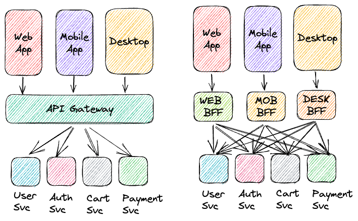
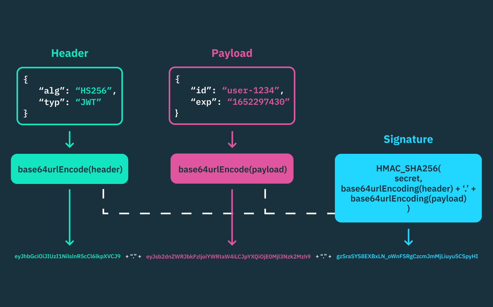

# APIs et ORMs

## intro: architecture

<ins>1. service</ins>

* un objet qui délivre une valeur pour un client
  + dont il ne connaît que l'interface / signature publique
  + et dont il est dégagé des problématiques de maintenabilité et évolutivité

* inforatique: une unité d'exécution isolé du reste d'un système
   + via bare-metal / VM / conteneur
   + communique sur le réseau


<ins>2. interface (POO)</ins>

* ensemble de définitions / signatures publiques abstraites
  + nom / paramètres / types de retours
  + à implémenter dans les classes / types de données
  + pour standardiser une activité

* dans les langages de programmation on a comme interfaces les
  + interfaces au sens Java / Php (implements)
  + classes abstraites
  + contrats d'API (REST / SOAP / GRAPHQL / gRPC)

<ins>3. Injection de dépendances</ins>

> dans un couple utilisateur / dépendance,
> un utilisateur ne doit connaître que l'interface publique de sa dépendace
> en particulier ne connaît pas le moyen de créer sa dépendance

<ins>4. Principe d'Inversion de dépendances</ins>

> dans un couple utilisateur / dépendance,
> un utilisateur ne devrait utiliser que des abstractions (interfaces/classes abstraites...)
> et les dépendances implémentent ces abstractions

<ins>5. architecture hexagonale</ins>

* dans une architecture distribuée en couche
  + la logique serveur (code métier / backend)
  + devrait être indépendante des autres couches (présentation / données / fournisseurs d'APIs)

* cette indépendance est réalisée par un ensemble d'outils présentant une Inversion de dépendance
  + client d'api
  + ORMs: Object Relational Mapper


<ins>6. archi µservices classiques</ins>



## authentification Oauth2 avec un jeton JWT: Json Web Token


### principe du jeton JWT



### stratégie

1. création du jeton `auth.create_access_token`
2. création du router `auth_router`
  + ajouter la route `/login`
3. vérification du jeton: `auth.verify_token`
  + un test du token avec la route `/me`


## faire persister les données avec une bdd sqlite3 et l'ORM SQLAlchemy

### Object Relational Mapper

* outil de manipulation de la couche de donnée relationnelle à partir d'interfaces dédiée
* l'ORM doit réaliser une **inversion de dépendance**

```
|                        indépendant                        |            remplaçables          
|------------------------Logique Serveur -------------------|-------DAO----------|---DATA-----
 FASTAPI -> Route -> Interface (classe abstraite) ASSEZ FIXE -> ORM(SQLAlchemy) -> DB(sqlite3)
```

### capacités d'un ORM: SqlAlchemy 2+


1. décrire un modèle de données avec leurs relations
2. en déduire une base de donnée Relationnelle selon une configuration (sqlite3)
3. exécuter/mettre en cache les lectures/écritures vers/depuis la bdd
4. organiser les migrations de données en utilisant le composant **alembic**


### gestion des couches de données

```python

# un objet python: n'existe pas en cache ni en bdd
user = User(username="admin", password="secret123")

# çà nous créé la requête d'insertion mais l'enregistrement n'est pas mis en cache ni en bdd
db.add(user)

# mise en cache => d'autres requêtes peuvent lire la table à partir du cache, dans la session courante
db.flush()

# mise en bdd => for REAL
db.commit()

user.username = "Admin"
db.refresh(user) # "admin" => on restaure l'état du cache après le dernier flush

# parallèlement, on pourrait enlever explicitement les modifications non flushées
db.expire(user) # "admin" aussi

```

### scenarios de chargements de données en cas de relation ou jointure

1. relationship(... `lazy="select"`)
  + **Lazy loading** par défaut
  + a besoin d'une session
  + économise la mémoire Mais bcp de requêtes

```python
class Person(Base):
    __tablename__ = "persons"
    addresses: Mapped[List["Address"]] = relationship(
        back_populates="person",
        lazy="select"  # Par défaut
    )

# Charger une personne
person = db.execute(select(Person).where(Person.id == 1)).scalar()
# SQL: SELECT * FROM persons WHERE id = 1

# Premier accès à person.addresses => déclenche une nouvelle requête
addresses = person.addresses
# SQL: SELECT * FROM addresses WHERE person_id = 1
```

2. `lazy="joined"`
  + **Eager Loading**
  + sans session
  + une seule requête Mais bcp de données (voire inutiles)
  + possibles jointures complexes => lent

```python
# Charger une personne
person = db.execute(select(Person).where(Person.id == 1)).scalar()
# Les addresses sont DÉJÀ chargées en une seule requête
addresses = person.addresses  # Pas de requête SQL supplémentaire

# UNE SEULE requête avec LEFT OUTER JOIN
# SELECT persons.*, addresses.*
# FROM persons 
# LEFT OUTER JOIN addresses ON persons.id = addresses.person_id
# WHERE persons.id = 1;
```

3. `lazy="selectin"`
  + **Eager Loading** avec l'operateur **IN SQL**
  + et plus performant pour charger plusieurs objets
  + plus simple que Join
  + uniquement 2 requêtes pour une collection de données

```python
# Charger plusieurs personnes
persons = db.execute(select(Person).limit(3)).scalars().all()
# Les addresses sont chargées avec un SELECT IN

# -- Requête 1: Charger les personnes
# SELECT * FROM persons LIMIT 3;
# -- Résultat: persons avec id = 1, 2, 3

# -- Requête 2: Charger TOUTES les adresses en une fois
# SELECT * FROM addresses 
# WHERE addresses.person_id IN (1, 2, 3);
```

4. `lazy="immediate"`
  + **Eager Loading** avec deux requêtes pour chaque élément
  + plus simple que join Mais trop de requêtes pour une collection

```python
# Charger une personne (pas pour plusieurs !!!)
person = db.execute(select(Person).where(Person.id == 1)).scalar()
# Les addresses sont automatiquement chargées

# -- Requête 1: Charger la personne
# SELECT * FROM persons WHERE id = 1;

# -- Requête 2: Charger ses adresses (automatiquement, immédiatement après)
# SELECT * FROM addresses WHERE person_id = 1;
```

<ins>5. Recommandations</ins>

|Situation|lazy recommandé|Raison|
|---------|---------------|------|
|Relations rarement utilisées|select|Économise ressources|
|Toujours besoin des relations|joined|Une seule requête|
|Charger liste d'objets|selectin|Évite N+1, performant|
|Petites collections simples|joined|Simple et efficace|
|Relations complexes/volumineuses|select + explicite|Contrôle manuel|

<ins>6. jointures explicites - contrôle manuel</ins>

```python
from sqlalchemy.orm import joinedload, selectinload

# Forcer joined pour cette requête uniquement
persons = db.execute(
    select(Person)
    .options(joinedload(Person.addresses))
    .limit(3)
).scalars().all()

# Ou avec selectin
persons = db.execute(
    select(Person)
    .options(selectinload(Person.addresses))
    .limit(3)
).scalars().all()
```


## migrations de données avec Alembic

### stratégie

1. install: `pip install alembic`
2. initialiser: `alembic init alembic` **alembic/** et **alembic.ini** dans orm/
3. charger les modèles dans **alembic/env.py**: 
  + `from model import Base`
  + `target_metadata = Base.metadata`
  + dans `context.configure`: `render_as_batch: True` => SQLITE
4. déterminer le delta entre python <=> bdd: génère migration dans **alembic/versions/**
  + `alembic revision --autogenerate -m "preciser les modifs"`
5. exécuter la migration: `alembic upgrade head`

### autre types de migrations

```bash
# Aller à une version spécifique (ID de révision)
alembic upgrade 11a65d7cf638

# Avancer d'un certain nombre de migrations (+1, +2, etc.)
alembic upgrade +1

# Revenir en arrière d'une migration
alembic downgrade -1

# Revenir à une version spécifique
alembic downgrade 11a65d7cf638

# Revenir au début (supprimer toutes les migrations)
alembic downgrade base

# Voir la version actuelle
alembic current

# Voir l'historique des migrations
alembic history
```

## utiliser FastAPI en asynchrone

### pourquoi le faire ?

* fastapi gère des requêtes exécutées dans des threads.
si une requête effectue des opérations d'entrée/sortie (i/o) bloquantes, ex: appels à une base de données

* en utilisant les outils asynchrones et leurs coroutines, les opérations i/o peuvent être effectuées de manière non bloquante,
permettant à fastapi de gérer plus de requêtes en parallèle dans le même thread.

* Une coroutine python est une fonction définie avec **async def** qui, lorsqu'elle est exécutée par une **boucle d'événement**, peut se suspendre (avec **await**) pour céder le contrôle, puis être reprise plus tard.

### stratégie avec sqlalchemy + sqlite

1. installer les outils : `pip install aiosqlite`

2. `database.py`

```python
from sqlalchemy.ext.asyncio import create_async_engine, AsyncSession, async_sessionmaker
# ...
DB_URI = "sqlite+aiosqlite:///persons.db"
# ...
async_engine = create_async_engine(
    DB_URI,
    echo=True
)
# ...
AsyncSessionLocal = async_sessionmaker(autoflush=False, autocommit=False,class_=AsyncSession, bind=async_engine)
# ...
async def get_async_db() -> AsyncGenerator[AsyncSession, None]:
    # asyn with remplace try / finally car la session est terminée en sortant du contexte
    async with AsyncSessionLocal() as session:
        yield session
```

3. `init_db.py`

```python
import asyncio
from models import Base
from database import async_engine

async def init_db():
    async with async_engine.begin() as conn:
        await conn.run_sync(Base.metadata.create_all)
# ...
if __name__ == "__main__":
    asyncio.run(init_db())
```

4. `models.py`

> RIEN car les modèles SQLALCHEMY 2+ sont nativement asynchrones !

5. `router.py`

```python
from sqlalchemy.ext.asyncio import AsyncSession
from ..orm.database import get_async_db

@user_router.get("/{user_id}")
async def fetch_user(user_id: int, db: AsyncSession = Depends(get_async_db)):
    result = await db.execute(select(UserModel).where(UserModel.id == user_id))
    user = result.scalar()
    if not user:
        raise HTTPException(status_code=404)
    return user.to_dict()
```

<ins>6. changements clés</ins>

1. `def` -> `async def`
2. `Session` -> `AsyncSession`
3. `get_db` -> `get_async_db`
4. `db.execute()` -> `await db.execute()`
5. `db.commit()` -> `await db.commit()`
6. `db.add()` -> reste identique (pas async)
7. `db.refresh()` -> `await db.refresh()`
8. `db.delete(user)` -> `await db.delete(user)`


## TESTS d'intégrations avec Mocks

### stratégie

1. install: `pip install pytest pytest-cov httpx`
2. placer un package **tests/** et un fichier **pytest.ini** dans **app/**
3. créer fichier de config **tests/conftest.py** qui contient
  + des fixtures: ressources nécessaires aux tests
  + autres options

4. écrire les fixtures en utilisant des Mocks
  + classe qui imite le comportement d'un autre objet nécessaire au test
  + mais lent et non constitutif de ce qu'on veut tester
  + TestClient: objet qui simule une requête http (hors déploiement)
  + Mock normal: c'est à nous de donner le comportement complet à imiter
  + MagickMock: BEAUCOUP de comportements déjà cablés !!

5. écrire des tests en utilisant des fixtures et des Mocks

6. lancer les tests
  + `pytest -v [-s]` dans app/
  + `-s`: affiche les prints


